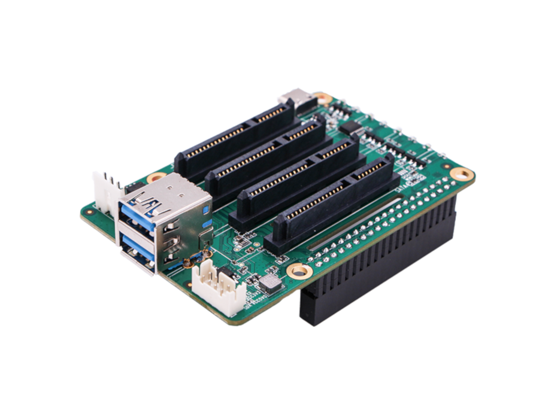

# ROCK Pi Quad SATA

[Quad SATA HAT wiki](<https://wiki.radxa.com/Dual_Quad_SATA_HAT>)

## Installation

```bash
sudo apt update
sudo apt install raspi-config python3-dev python3-rpi.gpio
wget https://github.com/radxa/rockpi-quad/releases/download/0.3.0/rockpi-quad.deb
sudo apt install -y ./rockpi-quad.deb
```

[Penta SATA HAT docs](https://docs.radxa.com/en/accessories/penta-sata-hat)


